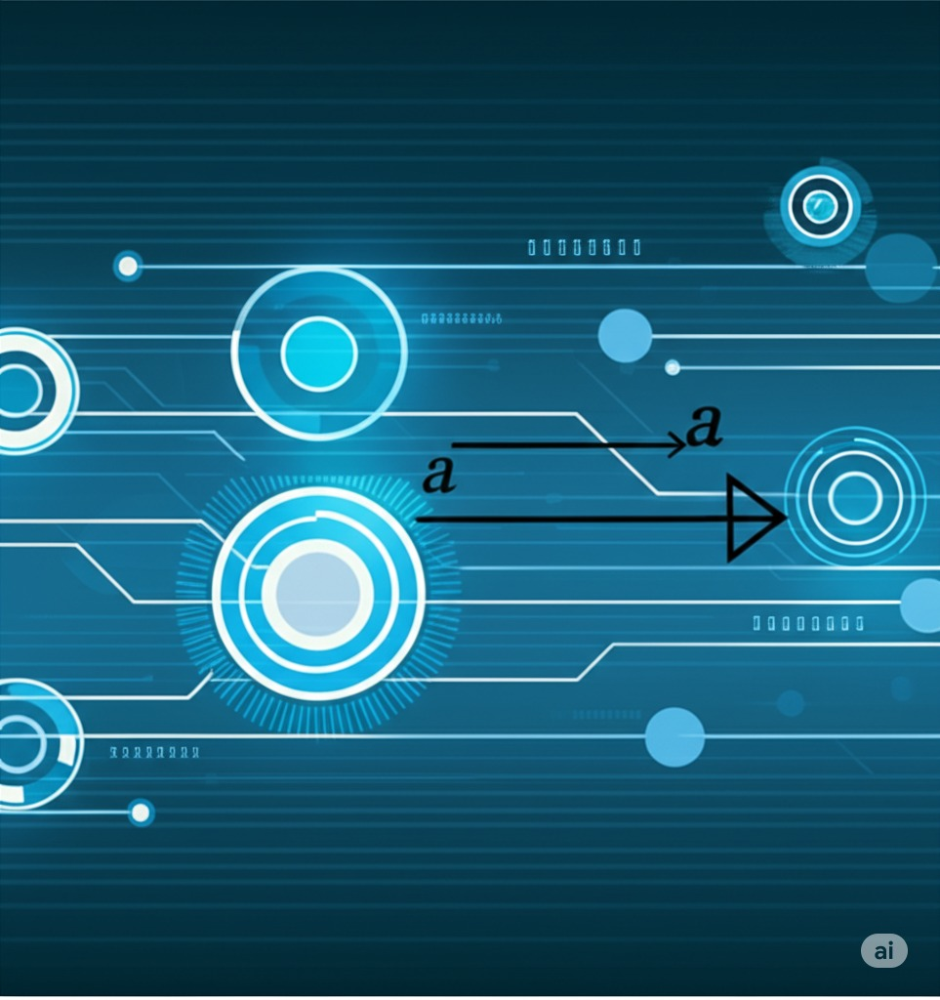

# Session 1: Introduction et Mathématiques Essentielles (4 blocs)

---

Physique dans le Jeu Vidéo - Session 1: Introduction et Mathématiques Essentielles (avec Rapier)

Bienvenue ! Ce cours vous plongera dans la physique des jeux vidéo, en utilisant Rapier, un moteur physique performant en Rust, facilement utilisable dans le navigateur. Nous allons explorer les bases de la physique pour créer des expériences de jeu immersives et réalistes.

---

Qu'allez-vous apprendre ?

*   Comprendre les principes de la physique classique.
*   Appliquer ces principes à la création de jeux vidéo.
*   Utiliser **Rapier** (dans le navigateur) pour simuler des objets physiques.
*   Développer des compétences en programmation orientées physique.

---

Comment se déroulera le cours ?

*   10 Sessions, 4 blocs par session.
*   **Évaluation :**
    *   Devoirs (30%) : Implémentations pratiques.
    *   Examen de Mi-Session (30%) : Quiz Théorique
    *   Examen Final (40%) : Théorie + Application (jeu complet).
*   Accès aux ressources : (Livre de référence, Documentation Rapier, Forum en ligne).

---

La Physique : Plus que des explosions !

*   L'immersion : le réalisme améliore l'expérience du joueur.
*   Le gameplay :  Nouvelles mécaniques de jeu, interactions dynamiques.
*   Exemples : *The Legend of Zelda: Breath of the Wild*, *Portal*, *Angry Birds* (rappeler que ces jeux sont toujours des exemples).

---

Vecteurs : Le GPS des Objets Virtuels

*   Les vecteurs : Magnitude (longueur) et direction.
*   Décrivent la position, la vitesse, l'accélération, les forces.
*   Essentiels pour décrire le mouvement et les interactions.

---

Déplacements et Différences

*   **Addition :**  $\vec{a} + \vec{b}$ (tête-bêche, parallélogramme).
*   **Soustraction :**  $\vec{a} - \vec{b}$.
*   Utilisation : Déplacer un objet, trouver la distance entre deux points.

---

Changer la Vitesse ou la Force

*   $k \vec{a}$ : Modification de la *magnitude* (longueur) du vecteur.
*   $k > 1$ :  "Accélérer" / Augmenter la force.
*   $0 < k < 1$ : "Ralentir" / Diminuer la force.
*   $k < 0$ : Inverser la direction.

---

Le secret des angles

*   Explication du produit scalaire : Formule et explication géométrique (projection).
*   Exemples : Déterminer l'angle entre des vecteurs, l'éclairage (survol).
*   Si proche de 1 : même direction ; -1 : directions opposées ; 0 : perpendiculaires.

---

Rotation et Orientation

*   En 2D :  Calcul du sens d'une rotation (sens horaire ou anti-horaire).
*   Applications : Utile pour le sens des rotations.

---

Le Rythme du Mouvement

*   Vitesse : Dérivée de la position par rapport au temps ($\vec{v} = \frac{d\vec{x}}{dt}$).
*   Accélération : Dérivée de la vitesse par rapport au temps ($\vec{a} = \frac{d\vec{v}}{dt}$).

---

L'Inversion du Temps

*   Position : Intégrale de la vitesse.
*   Vitesse : Intégrale de l'accélération.
*   Lien avec l'intégration numérique (concept général).

---

Bienvenue dans Rapier ! (dans le navigateur)

*   Présentation du framework.
*   Lien vers les ressources et la documentation.

---

Votre premier objet physique !

*   Explication du code "Hello World" simplifié en Rapier.
*   Classes clés : *RigidBody*, *Collider*, *PhysicsWorld*.
*   (Mettre en évidence le code HTML, JS).

---

Activité : Bouger un Carré (Ouverture de la session 2)

*   Activité : Modifier les valeurs pour faire bouger le carré.
*   Préparer les équations de la session 2, et les faire jouer.
*   Questions et réponses

