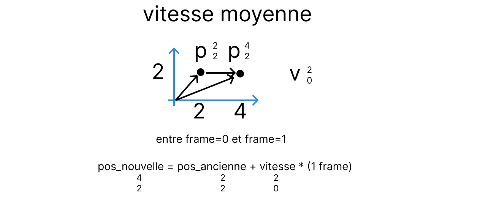

Notre temps de référence est le temps écoulé entre une frame et la suivante.

c'est le temps le plus petit possible pour afficher une image au joueur.

Si entre 2 frames, un point se déplace de 2 vers la droite alors on a:

On est d'accord pour dire que si le point s'est déplacé de 2 vers la droite, alors sa vitesse moyenne est de 2. Dans cet exemple, pour simplifier, on dit qu'il y a une seconde entre chaque frame. Pour avoir donc 2m/s.

L'unité de vitesse est le mètre par seconde.

On voit bien en plaçant les points sur le même graphique entre les deux points, c'est la vitesse moyenne entre ces deux points.

Ici la vitesse est de 2 mètres par seconde sur la droite.

Si maintenant on prend 3 frames, on voit bien que la vitesse peut elle aussi changer. Le changement de vitesse est l'accélération.