**Physique dans le Jeu Vidéo - Session 1 : Introduction et Mathématiques Essentielles (avec Rapier)**

Bienvenue ! Ce cours vous plongera dans la physique des jeux vidéo, en utilisant **Rapier**, un moteur physique performant écrit en Rust et compilable pour le navigateur via WebAssembly. Nous allons explorer les bases de la physique pour créer des expériences de jeu immersives et réalistes.

[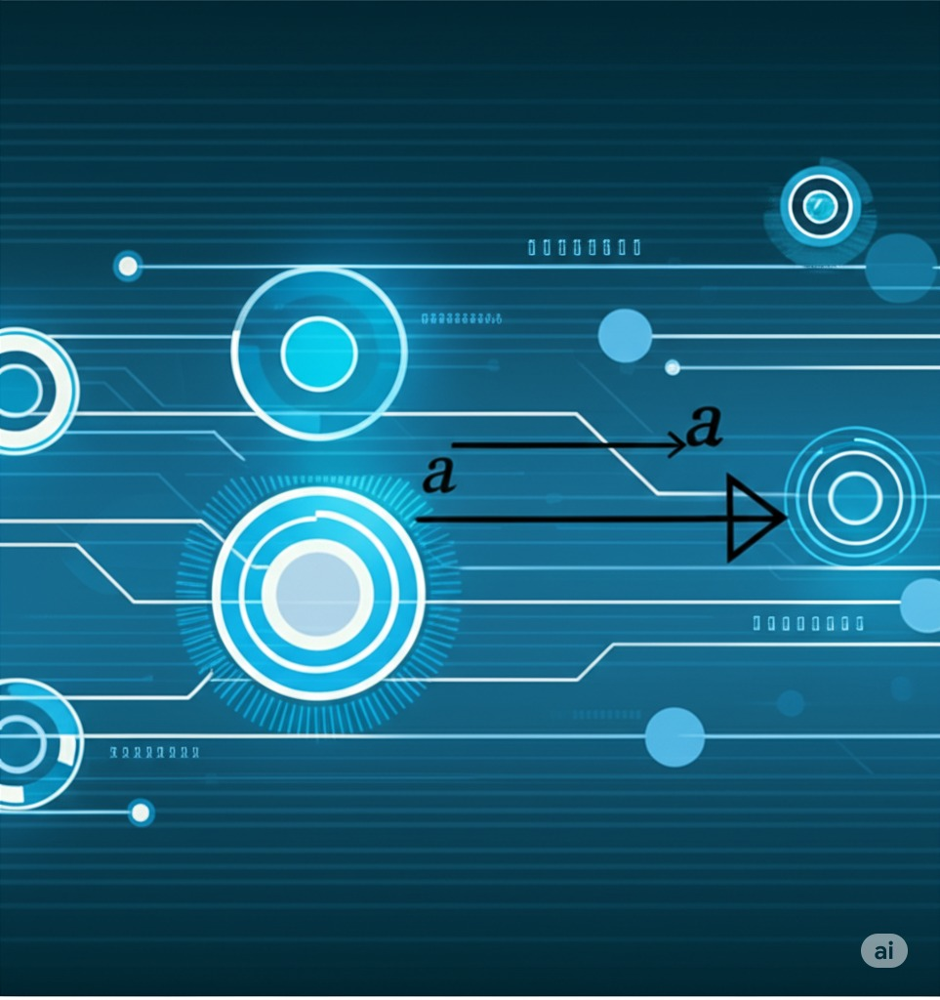](../images/intro.png)

---

**Qu'allez-vous apprendre ?**

- Comprendre les principes fondamentaux de la physique classique pertinents pour les jeux vidéo.
- Appliquer ces principes pour concevoir des mécaniques de jeu interactives et crédibles.
- Utiliser **Rapier** directement dans votre navigateur pour simuler des objets physiques et leurs interactions.
- Développer des compétences en programmation orientée physique, en manipulant des concepts mathématiques clés.

[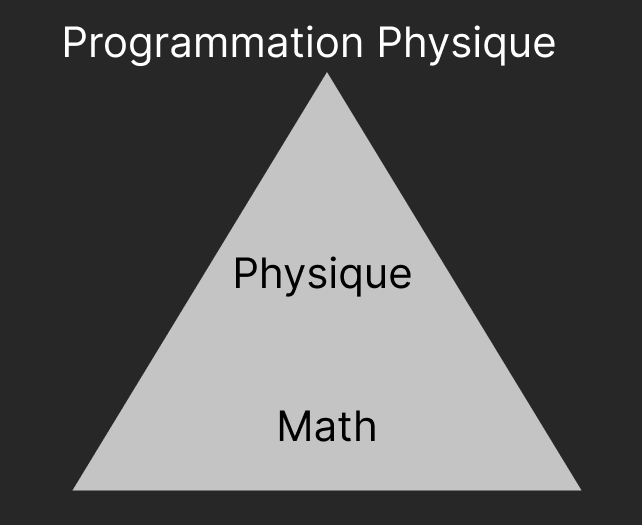](../images/pyramide.png)

---

**Comment se déroulera le cours ?**

- Le cours est structuré en 10 sessions, chacune divisée en 4 blocs thématiques pour faciliter l'apprentissage progressif.
- **Évaluation :**
  - **Devoirs (40%)** : Plusieurs exercices d'implémentation pratique des concepts appris, utilisant Rapier.
  - **Examen de Mi-Session (30%)** : Un quiz théorique pour évaluer votre compréhension des principes fondamentaux.
  - **Examen Final (30%)** : Une évaluation combinant théorie et application, culminant dans la création d'un jeu simple intégrant la physique.
- **Accès aux ressources :** Un livre de référence sera recommandé, la documentation officielle de Rapier sera essentielle, et un forum en ligne sera disponible pour les échanges et l'entraide.

[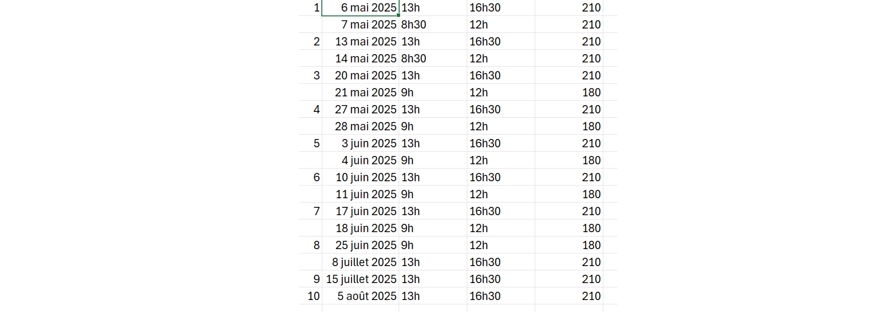](images/course_calendar.png)

---

**La Physique : Bien plus que des explosions !**

La physique dans les jeux vidéo ne se limite pas aux effets spectaculaires. Elle est le moteur de l'**immersion**, où un comportement réaliste des objets et de l'environnement renforce la crédibilité de l'expérience du joueur. Elle ouvre également la voie à de nouvelles mécaniques de **gameplay**, en permettant des interactions dynamiques et des solutions créatives basées sur les lois physiques.

- **L'immersion :** Un monde régi par des règles physiques cohérentes rend l'expérience plus crédible et engageante. Pensez à la sensation d'un saut réaliste ou à la réaction d'un objet à un impact.
- **Le gameplay :** La physique permet de concevoir des interactions uniques et innovantes. Des énigmes basées sur la manipulation d'objets (comme dans _Portal_), la destruction stratégique d'environnements (comme dans _Angry Birds_), ou l'exploration d'un monde avec des propriétés physiques complexes (comme dans _The Legend of Zelda: Breath of the Wild_).
- **Exemples :** _The Legend of Zelda: Breath of the Wild_ (interactions complexes avec l'environnement, utilisation de pouvoirs physiques), _Portal_ (mécanique unique basée sur les lois de la physique et la géométrie), _Angry Birds_ (trajectoires balistiques et destruction). Rappelez-vous que ces jeux servent d'illustrations des concepts que nous allons étudier.

[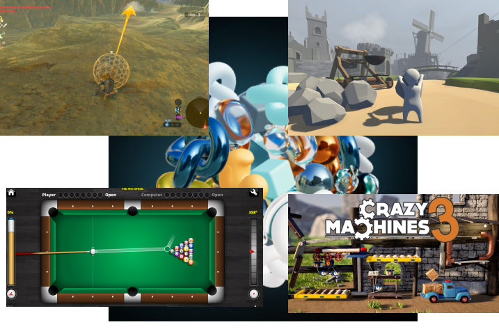](../images/example_01.png)

---

**Vecteurs : Le GPS des Objets Virtuels**

Les **vecteurs** sont des outils mathématiques fondamentaux pour décrire des quantités qui ont à la fois une **magnitude** (une longueur ou une intensité) et une **direction**. Ils sont essentiels pour représenter et manipuler des concepts physiques dans un espace 2D ou 3D.

- **Les vecteurs :** Définis par leur magnitude (représentée par $|\vec{v}|$) et leur direction (souvent un angle par rapport à un axe de référence).
- **Décrivent :**
  - **Position** ($\vec{r}$) : L'emplacement d'un objet dans l'espace.
  - **Vitesse** ($\vec{v}$) : Le taux de changement de la position au fil du temps, indiquant à quelle vitesse et dans quelle direction un objet se déplace.
  - **Accélération** ($\vec{a}$) : Le taux de changement de la vitesse au fil du temps, indiquant comment la vitesse d'un objet change en magnitude ou en direction.
  - **Force** ($\vec{F}$) : Une interaction qui peut modifier l'état de mouvement d'un objet.
- **Essentiels pour :** La description mathématique du mouvement, des interactions entre objets et de nombreuses autres notions physiques.

[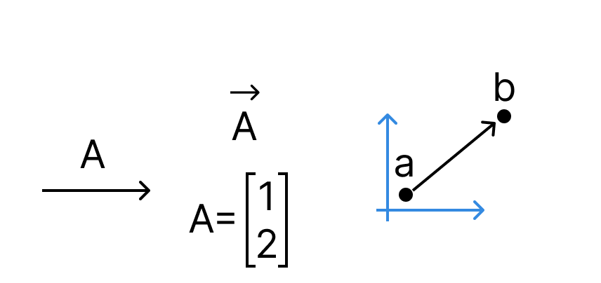](../images/vectors.png)

- **Références :** Pour une excellente introduction visuelle aux vecteurs et à d'autres concepts mathématiques, consultez la chaîne YouTube 3Blue1Brown : [https://www.youtube.com/@3blue1brown](https://www.youtube.com/@3blue1brown)

---

**Déplacements et Différences Vectorielles**

- **Addition de vecteurs :** $\vec{c} = \vec{a} + \vec{b}$.

  - **Méthode tête-bêche :** Placez la queue du vecteur $\vec{b}$ à la tête du vecteur $\vec{a}$. Le vecteur résultant $\vec{c}$ va de la queue de $\vec{a}$ à la tête de $\vec{b}$.
  - **Méthode du parallélogramme :** Placez les queues de $\vec{a}$ et $\vec{b}$ à la même origine. Le vecteur résultant $\vec{c}$ est la diagonale du parallélogramme formé par $\vec{a}$ et $\vec{b}$.
  - En composantes : Si $\vec{a} = \begin{pmatrix} a_x \\ a_y \end{pmatrix}$ et $\vec{b} = \begin{pmatrix} b_x \\ b_y \end{pmatrix}$, alors $\vec{a} + \vec{b} = \begin{pmatrix} a_x + b_x \\ a_y + b_y \end{pmatrix}$.

- **Soustraction de vecteurs :** $\vec{d} = \vec{a} - \vec{b} = \vec{a} + (-\vec{b})$. Soustraire un vecteur $\vec{b}$ revient à ajouter son opposé ($-\vec{b}$), qui a la même magnitude mais une direction opposée.
  - En composantes : $\vec{a} - \vec{b} = \begin{pmatrix} a_x - b_x \\ a_y - b_y \end{pmatrix}$.

[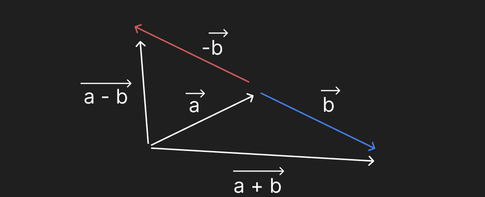](../images/addition.png)

- **Utilisation :**
  - **Déplacer un objet :** Un vecteur de déplacement $\Delta \vec{r}$ représente le changement de position d'un objet. Si un objet est à la position $\vec{r}_1$ et subit un déplacement $\Delta \vec{r}$, sa nouvelle position sera $\vec{r}_2 = \vec{r}_1 + \Delta \vec{r}$.
  - **Trouver la distance et la direction entre deux points :** Si les points A et B ont pour vecteurs position $\vec{r}_A$ et $\vec{r}_B$, le vecteur allant de A à B est $\vec{r}_{AB} = \vec{r}_B - \vec{r}_A$. La magnitude $|\vec{r}_{AB}|$ donne la distance entre A et B, et la direction du vecteur indique la direction de B par rapport à A.

---

**Changer la Magnitude d'un Vecteur : Multiplication Scalaire**

La multiplication d'un vecteur $\vec{a}$ par un scalaire $k$ (un nombre réel) produit un nouveau vecteur dont la direction est la même que celle de $\vec{a}$ si $k > 0$, opposée si $k < 0$, et dont la magnitude est $|k|$ fois la magnitude de $\vec{a}$.

- **Formule :** $k \vec{a} = k \begin{pmatrix} a_x \\ a_y \end{pmatrix} = \begin{pmatrix} k a_x \\ k a_y \end{pmatrix}$.

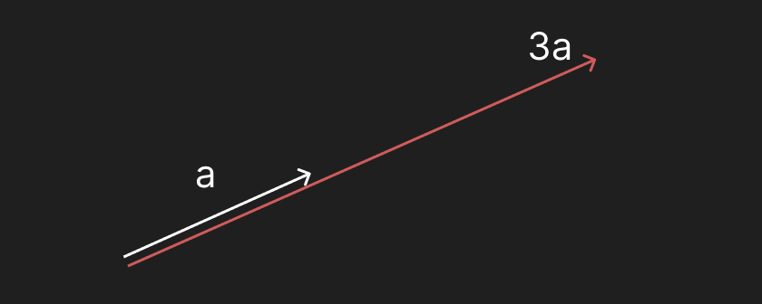]

- **Interprétation :**
  - **$k > 1$ :** Le vecteur résultant est plus long que $\vec{a}$ ("accélérer" la vitesse ou augmenter l'intensité de la force).
  - **$0 < k < 1$ :** Le vecteur résultant est plus court que $\vec{a}$ ("ralentir" la vitesse ou diminuer l'intensité de la force).
  - **$k = 0$ :** Le vecteur résultant est le vecteur nul $\vec{0} = \begin{pmatrix} 0 \\ 0 \end{pmatrix}$.
  - **$k < 0$ :** Le vecteur résultant a la même longueur que $|k| \vec{a}$ mais pointe dans la direction opposée (inverser le sens de la vitesse ou de la force).

[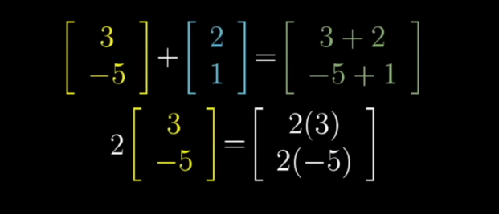](../images/dim2.png)

---

**Le Produit Scalaire (Dot Product)**

Le produit scalaire de deux vecteurs $\vec{a}$ et $\vec{b}$ est un scalaire (un simple nombre) qui mesure à quel point les deux vecteurs sont alignés.

- **Définition par la magnitude et l'angle :**
  $$
  \vec{a} \cdot \vec{b} = |\vec{a}| |\vec{b}| \cos(\theta)
  $$

où $|\vec{a}|$ et $|\vec{b}|$ sont les magnitudes des vecteurs $\vec{a}$ et $\vec{b}$ respectivement, et $\theta$ est l'angle entre eux ($0 \le \theta \le 180^\circ$).

- **Définition par les composantes :** Si $\vec{a} = \begin{pmatrix} a_x \\ a_y \end{pmatrix}$ et $\vec{b} = \begin{pmatrix} b_x \\ b_y \end{pmatrix}$, alors :
  $$
  \vec{a} \cdot \vec{b} = a_x b_x + a_y b_y
  $$

[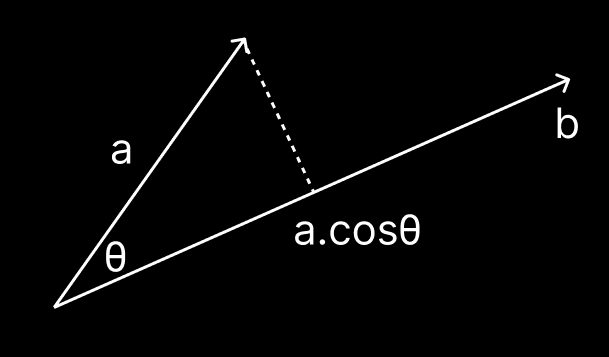](../images/dot.png)

- **Interprétation géométrique :** Le produit scalaire peut être vu comme la projection de la magnitude d'un vecteur sur la direction de l'autre, multipliée par la magnitude de ce dernier.

- **Signification du signe du produit scalaire :**

  - Si $\vec{a} \cdot \vec{b} > 0$ (et $\vec{a}, \vec{b} \neq \vec{0}$), alors $\cos(\theta) > 0$, ce qui signifie que l'angle $\theta$ est aigu ($0^\circ \le \theta < 90^\circ$). Les vecteurs ont tendance à pointer dans la même direction.
  - Si $\vec{a} \cdot \vec{b} < 0$ (et $\vec{a}, \vec{b} \neq \vec{0}$), alors $\cos(\theta) < 0$, ce qui signifie que l'angle $\theta$ est obtus ($90^\circ < \theta \le 180^\circ$). Les vecteurs ont tendance à pointer dans des directions opposées.
  - Si $\vec{a} \cdot \vec{b} = 0$, alors $\cos(\theta) = 0$, ce qui signifie que l'angle $\theta$ est de $90^\circ$ (ou l'un des vecteurs est nul). Les vecteurs sont **perpendiculaires** (orthogonaux).

- **Applications :**
  - **Déterminer l'angle entre deux vecteurs :** $\cos(\theta) = \frac{\vec{a} \cdot \vec{b}}{|\vec{a}| |\vec{b}|}$.
  - **Calculer la projection d'un vecteur sur un autre.**
  - **En éclairage dans les jeux vidéo :** L'intensité de la lumière réfléchie par une surface dépend de l'angle entre le vecteur normal à la surface et le vecteur direction de la lumière (le produit scalaire est utilisé pour ce calcul). Un produit scalaire proche de 1 indique que la lumière frappe la surface presque directement, résultant en une illumination forte. Un produit scalaire proche de 0 indique une lumière rasante, et un produit scalaire négatif signifie que la lumière frappe l'autre côté de la surface.

---

**Le Produit Vectoriel (Cross Product)**

Le produit vectoriel de deux vecteurs $\vec{u}$ et $\vec{v}$ en 3D produit un nouveau vecteur $\vec{w} = \vec{u} \times \vec{v}$ qui est **perpendiculaire** (orthogonal) au plan formé par $\vec{u}$ et $\vec{v}$.

- **Magnitude :** La magnitude du produit vectoriel est donnée par :
  \[
  |\vec{u} \times \vec{v}| = |\vec{u}| |\vec{v}| \sin(\theta)
  \]
  où $\theta$ est l'angle entre $\vec{u}$ et $\vec{v}$ ($0 \le \theta \le 180^\circ$). La magnitude représente l'aire du parallélogramme formé par $\vec{u}$ et $\vec{v}$.

- **Direction :** La direction de $\vec{u} \times \vec{v}$ est donnée par la **règle de la main droite**. Si vous courbez les doigts de votre main droite de la direction de $\vec{u}$ vers la direction de $\vec{v}$ (par le plus petit angle), alors votre pouce pointe dans la direction de $\vec{u} \times \vec{v}$.

- **Calcul en composantes (en 3D) :**

Si

$\vec{u} = \begin{pmatrix} u_1 \\ u_2 \\ u_3 \end{pmatrix}$ et $\vec{v} = \begin{pmatrix} v_1 \\ v_2 \\ v_3 \end{pmatrix}$,

alors :

$
\vec{u} \times \vec{v} = \begin{pmatrix} u_2 v_3 - u_3 v_2 \\  u_3 v_1- u_1 v_3  \\ u_1 v_2 - u_2 v_1 \end{pmatrix}
$

$
\vec{u} \times \vec{v} = (u_2 v_3 - u_3 v_2) \hat{i} + (  u_3 v_1 - u_1 v_3) \hat{j} + (u_1 v_2 - u_2 v_1) \hat{k}
$

- **Applications :**
  - **Trouver la normale à une surface :** Si deux vecteurs se trouvent dans le plan d'une surface (par exemple, deux arêtes d'un triangle), leur produit vectoriel donne un vecteur normal (perpendiculaire) à cette surface. Ceci est crucial pour l'éclairage, la détection de collisions et l'orientation des faces dans les modèles 3D.
  - **Calcul du moment de force (torque).**
  - **En 2D (version simplifiée) :** En 2D, le produit vectoriel de deux vecteurs $\vec{a} = \begin{pmatrix} a_x \\ a_y \\ 0 \end{pmatrix}$ et $\vec{b} = \begin{pmatrix} b_x \\ b_y \\ 0 \end{pmatrix}$ résulte en un vecteur pointant soit dans la direction positive ou négative de l'axe Z (perpendiculaire à l'écran). La magnitude de ce vecteur scalaire (le composant Z) est $a_x b_y - a_y b_x$. Le signe de ce scalaire indique le sens de rotation de $\vec{a}$ vers $\vec{b}$ (par exemple, horaire ou anti-horaire).

[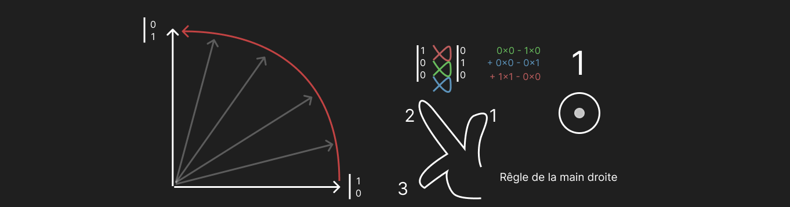](images/cross_product_2d.png)

---

**Le Rythme du Mouvement : Vitesse et Accélération**

- **Position** ($\vec{r}(t)$) : Décrit l'emplacement d'un objet en fonction du temps $t$. L'unité SI est le mètre (m).

- **Vitesse** ($\vec{v}(t)$) : Le taux de changement de la position par rapport au temps. C'est la dérivée du vecteur position par rapport au temps :

  $
  \vec{v}(t) = \frac{d\vec{r}(t)}{dt} = \lim\_{\Delta t \to 0} \frac{\vec{r}(t + \Delta t) - \vec{r}(t)}{\Delta t}
  $

  Les unités SI sont le mètre par seconde ($m/s$ ou $m \cdot s^{-1}$). La vitesse est un vecteur, possédant une magnitude (la vitesse scalaire, $|\vec{v}|$) et une direction (la direction du mouvement). La vitesse est la tangente à la trajectoire.

- **Accélération** ($\vec{a}(t)$) : Le taux de changement de la vitesse par rapport au temps. C'est la dérivée du vecteur vitesse par rapport au temps (ou la seconde dérivée du vecteur position) :

  $
  \vec{a}(t) = \frac{d\vec{v}(t)}{dt} = \lim\_{\Delta t \to 0} \frac{\vec{v}(t + \Delta t) - \vec{v}(t)}{\Delta t} = \frac{d^2\vec{r}(t)}{dt^2}
  $

  Les unités SI sont le mètre par seconde au carré ($m/s^2$ ou $m \cdot s^{-2}$). L'accélération est également un vecteur et indique comment la vitesse (magnitude ou direction) d'un objet change.

- **L'Inversion du Temps : Intégration**

  - Si nous connaissons la vitesse $\vec{v}(t)$, nous pouvons trouver la position $\vec{r}(t)$ par intégration :

    $
    \vec{r}(t) = \vec{r}_0 + \int_{t_0}^{t} \vec{v}(t) dt
    $

    où $\vec{r}_0$ est la position initiale à l'instant $t_0$.

  - De même, si nous connaissons l'accélération $\vec{a}(t)$, nous pouvons trouver la vitesse $\vec{v}(t)$ par intégration :

    $
    \vec{v}(t) = \vec{v}_0 + \int_{t_0}^{t} \vec{a}(t) dt
    $

    où $\vec{v}_0$ est la vitesse initiale à l'instant $t_0$.

  - **Lien avec l'intégration numérique :** Dans les simulations de physique, nous mettons souvent à jour la position et la vitesse des objets en utilisant de petites étapes de temps $\Delta t$. Cela correspond à une forme d'intégration numérique approximative des équations du mouvement.
    Par exemple, si nous connaissons la vitesse à un instant $t$, nous pouvons estimer la position à l'instant $t + \Delta t$ par $\vec{r}(t + \Delta t) \approx \vec{r}(t) + \vec{v}(t) \Delta t$. De même, la vitesse peut être mise à jour en utilisant l'accélération.

[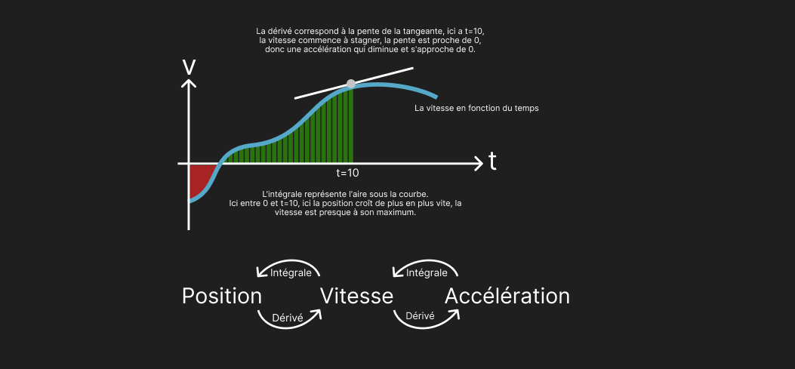](images/integration.png)

---

**Bienvenue dans Rapier ! (dans le navigateur)**

**Rapier** est une bibliothèque de physique 2D et 3D open-source, écrite en Rust, qui se distingue par sa performance et sa facilité d'intégration dans des environnements web grâce à la compilation vers WebAssembly.

- **Présentation du framework :** Rapier fournit des outils pour créer des mondes physiques, définir des corps rigides (objets avec masse et inertie), des colliders (formes physiques pour la détection des collisions), et simuler leurs interactions sous l'effet de forces et de contraintes.
- **Ressources et documentation :** La documentation officielle de Rapier est une ressource précieuse pour apprendre à utiliser la bibliothèque. Elle contient des guides, des exemples et une référence API complète : [https://rapier.rs/](https://rapier.rs/). Nous explorerons également des exemples spécifiques adaptés au contexte du développement web.

[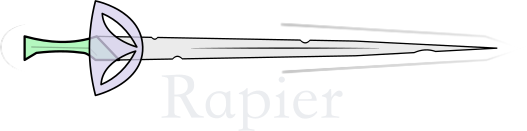

---

**Votre premier template physique !**

Nous allons maintenant examiner un exemple de code simplifié utilisant Rapier dans un environnement web. Ce code illustrera les étapes de base pour nos projets par la suite.

- **Classes clés de Rapier :**
  - `RigidBody` : Représente un corps physique qui peut se déplacer et interagir avec d'autres corps. Il possède une masse, une inertie, une position et une orientation.
  - `Collider` : Définit la forme physique d'un objet, utilisée pour détecter les collisions avec d'autres colliders. Un corps rigide peut avoir un ou plusieurs colliders associés.
  - `PhysicsWorld` : Le conteneur qui gère tous les corps rigides, les colliders, les forces et la simulation physique. C'est dans ce monde que les lois de la physique sont appliquées.
- **Structure typique du code (HTML et JavaScript) :** Nous verrons comment initialiser le `PhysicsWorld`, créer un `RigidBody` et un `Collider`, et les ajouter au monde. Nous observerons ensuite comment la simulation met à jour la position de l'objet (par exemple, un carré) sous l'effet de la gravité. (Un extrait de code simplifié sera présenté et expliqué ligne par ligne).

[Physics with Rapier](../physics-with-rapier-and-three/index.html)
