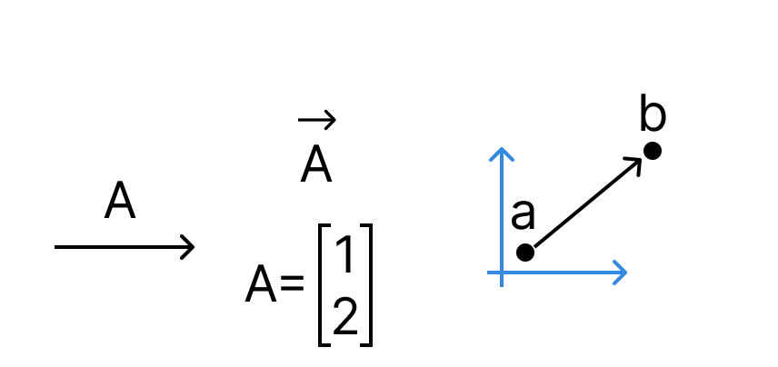

**Titre de la Session 2 : Cinématique 2D et Mouvement de Projectile**

**Objectifs de la Session :**

- Comprendre et appliquer les concepts de vitesse, d'accélération et de position en deux dimensions.
- Analyser et calculer la trajectoire d'un projectile soumis à la gravité.
- Implémenter le mouvement de projectiles dans l'environnement Rapier.
- Introduire les lois de Newton et leur pertinence pour la simulation de mouvement.
- Réaliser un premier travail pratique de création d'objets en mouvement et de projectiles simples avec Rapier.

---

**Bloc 1 : Cinématique 2D - Position, Vitesse et Accélération (environ 1h30)**

**Objectifs spécifiques de ce bloc :**

- Comprendre la représentation mathématique de la position d'un objet dans un plan bidimensionnel.
- Définir et interpréter les concepts de vitesse moyenne et instantanée sous forme vectorielle en 2D.
- Définir et interpréter les concepts d'accélération moyenne et instantanée sous forme vectorielle en 2D.
- Visualiser et relier les vecteurs position, vitesse et accélération à la trajectoire d'un objet.

---

**1. Introduction et Rappels (15 minutes)**

- **Brève révision des vecteurs (5 minutes) :**

  - Rappel de la définition d'un vecteur comme une quantité possédant une magnitude (longueur) et une direction.
  - Représentation d'un vecteur en 2D à l'aide de ses composantes : $\vec{v} = \begin{pmatrix} v_x \\ v_y \end{pmatrix}$.
  - Opérations vectorielles de base (addition et soustraction) :
    - $\vec{a} + \vec{b} = \begin{pmatrix} a_x + b_x \\ a_y + b_y \end{pmatrix}$
    - $\vec{a} - \vec{b} = \begin{pmatrix} a_x - b_x \\ a_y - b_y \end{pmatrix}$
  - Multiplication d'un vecteur par un scalaire : $k \vec{a} = \begin{pmatrix} k a_x \\ k a_y \end{pmatrix}$.

- **Introduction à la cinématique (5 minutes) :**

  - Définition de la cinématique comme la branche de la mécanique qui décrit le mouvement des objets sans considérer les causes du mouvement (les forces).
  - Contrairement à la dynamique, qui relie le mouvement aux forces.
  - Notre objectif dans ce bloc est de développer les outils mathématiques pour décrire précisément _comment_ les objets se déplacent en 2D.

- **Annonce des objectifs du Bloc 1 (5 minutes) :**
  - À la fin de ce bloc, vous serez capable de :
    - Exprimer la position, la vitesse et l'accélération d'un objet en 2D sous forme vectorielle.
    - Comprendre la relation mathématique entre la position, la vitesse et l'accélération.
    - Interpréter physiquement les composantes de ces vecteurs.

---

**2. Position en 2D (20 minutes)**

- **Vecteur Position (10 minutes) :**

  - Pour décrire la localisation d'un point (ou d'un objet considéré comme un point) dans un plan bidimensionnel, nous utilisons le **vecteur position**, noté $\vec{r}$ (ou parfois $\vec{s}$ ou $\vec{x}$).
  - Si nous définissons un système de coordonnées cartésiennes avec un axe horizontal ($x$) et un axe vertical ($y$), le vecteur position d'un point $P$ de coordonnées $(x, y)$ est donné par :
    $
    \vec{r} = \begin{pmatrix} x \\ y \end{pmatrix} = x \hat{i} + y \hat{j}
    $
  où $\hat{i} = \begin{pmatrix} 1 \\ 0 \end{pmatrix}$ est le vecteur unitaire dans la direction de l'axe $x$, et $\hat{j} = \begin{pmatrix} 0 \\ 1 \end{pmatrix}$ est le vecteur unitaire dans la direction de l'axe $y$.
  - Le vecteur position pointe de l'origine du système de coordonnées vers la position de l'objet.
  - La **magnitude** du vecteur position, $|\vec{r}| = \sqrt{x^2 + y^2}$, représente la distance de l'objet à l'origine.
  - La **direction** du vecteur position peut être donnée par l'angle $\theta$ qu'il forme avec l'axe $x$, où $\tan(\theta) = \frac{y}{x}$.

    

- **Trajectoire (10 minutes) :**

  - Si la position d'un objet change au cours du temps, nous pouvons décrire son mouvement en spécifiant son vecteur position en fonction du temps : $\vec{r}(t) = \begin{pmatrix} x(t) \\ y(t) \end{pmatrix}$.
  - L'ensemble des points atteints par l'objet au cours de son mouvement forme sa **trajectoire**. La trajectoire est une courbe dans l'espace (ici, en 2D).
  - Exemples de trajectoires :
    - **Mouvement rectiligne uniforme :** $\vec{r}(t) = \begin{pmatrix} x_0 + v_x t \\ y_0 + v_y t \end{pmatrix}$, où $x_0, y_0, v_x, v_y$ sont des constantes. La trajectoire est une ligne droite.
    - **Mouvement circulaire uniforme :** $\vec{r}(t) = \begin{pmatrix} R \cos(\omega t) \\ R \sin(\omega t) \end{pmatrix}$, où $R$ est le rayon et $\omega$ la vitesse angulaire. La trajectoire est un cercle.
    - **Mouvement parabolique (projectile) :** $\vec{r}(t) = \begin{pmatrix} v_{0x} t \\ y_0 + v_{0y} t - \frac{1}{2} g t^2 \end{pmatrix}$ (sous l'effet de la gravité). La trajectoire est une parabole.
  - Visualisation de différentes trajectoires et des vecteurs position correspondants à différents instants.

- **Démo cinématique :** Pour visualiser les concepts de cinématique, consultez la démo : [file:../scenes/session02.html](../scenes/session02.html)

---

**3. Vitesse en 2D (25 minutes)**

    Visualisation de ce concept avec des exemples de trajectoires courbes.

=======

- **Vitesse Moyenne (10 minutes) :**

  - Considérons un objet qui se déplace de la position $\vec{r}_i$ à l'instant $t_i$ à la position $\vec{r}_f$ à l'instant $t_f$.
  - Le **déplacement** de l'objet pendant cet intervalle de temps $\Delta t = t_f - t_i$ est le vecteur :

    $\Delta \vec{r} = \vec{r}_f - \vec{r}_i = \begin{pmatrix} x_f - x_i \\ y_f - y_i \end{pmatrix} = \begin{pmatrix} \Delta x \\ \Delta y \end{pmatrix}$

  - Le **vecteur vitesse moyenne** $\vec{v}_{moy}$ est défini comme le rapport du déplacement au temps écoulé :

    $
    \vec{v}_{moy} = \frac{\Delta \vec{r}}{\Delta t} = \frac{\vec{r}_f - \vec{r}_i}{t_f - t_i} = \begin{pmatrix} \frac{\Delta x}{\Delta t} \\ \frac{\Delta y}{\Delta t} \end{pmatrix} = \begin{pmatrix} v_{moy, x} \\ v_{moy, y} \end{pmatrix}
    $

  - La vitesse moyenne est un vecteur dont la direction est la même que celle du déplacement, et dont la magnitude est le déplacement total divisé par le temps écoulé.

- **Vitesse Instantanée (15 minutes) :**
  - Pour décrire la vitesse de l'objet à un instant précis $t$, nous utilisons la notion de **vitesse instantanée**, $\vec{v}(t)$.
  - Mathématiquement, la vitesse instantanée est définie comme la limite de la vitesse moyenne lorsque l'intervalle de temps $\Delta t$ tend vers zéro :

    $
    \vec{v}(t) = \lim\_{\Delta t \to 0} \frac{\Delta \vec{r}}{\Delta t} = \frac{d\vec{r}}{dt}
    $

  - En termes de composantes, la vitesse instantanée est la dérivée des composantes de la position par rapport au temps :
    \[
    \vec{v}(t) = \begin{pmatrix} \frac{dx(t)}{dt} \\ \frac{dy(t)}{dt} \end{pmatrix} = \begin{pmatrix} v_x(t) \\ v_y(t) \end{pmatrix}
    \]
    où $v_x(t)$ est la composante de la vitesse selon l'axe $x$, et $v_y(t)$ est la composante de la vitesse selon l'axe $y$ à l'instant $t$.
  - La **magnitude** de la vitesse instantanée, $|\vec{v}(t)| = \sqrt{v_x(t)^2 + v_y(t)^2}$, est appelée **vitesse scalaire**.
  - La **direction** de la vitesse instantanée est tangente à la trajectoire de l'objet au point considéré. Visualisation de ce concept avec des exemples de trajectoires courbes.

---

**4. Accélération en 2D (25 minutes)**

- **Accélération Moyenne (10 minutes) :**

  - Si la vitesse d'un objet change au cours du temps, l'objet est en train d'accélérer.
  - Le **vecteur accélération moyenne** $\vec{a}_{moy}$ pendant un intervalle de temps $\Delta t = t_f - t_i$ est défini comme le rapport du changement de vitesse au temps écoulé :

    $
    \vec{a}_{moy} = \frac{\Delta \vec{v}}{\Delta t} = \frac{\vec{v}_f - \vec{v}_i}{t_f - t_i} = \begin{pmatrix} \frac{\Delta v_x}{\Delta t} \\ \frac{\Delta v_y}{\Delta t} \end{pmatrix} = \begin{pmatrix} a_{moy, x} \\ a_{moy, y} \end{pmatrix}
    $

  - L'accélération moyenne est un vecteur dont la direction est celle du changement de vitesse.

- **Accélération Instantanée (15 minutes) :**
  - L'**accélération instantanée** $\vec{a}(t)$ décrit la manière dont la vitesse d'un objet change à un instant précis $t$. Elle est définie comme la dérivée de la vitesse par rapport au temps :

    $
    \vec{a}(t) = \lim\_{\Delta t \to 0} \frac{\Delta \vec{v}}{\Delta t} = \frac{d\vec{v}}{dt}
    $

  - En termes de composantes, l'accélération instantanée est la dérivée des composantes de la vitesse par rapport au temps, ou la deuxième dérivée des composantes de la position par rapport au temps :

    $
    \vec{a}(t) = \begin{pmatrix} \frac{dv_x(t)}{dt} \\ \frac{dv_y(t)}{dt} \end{pmatrix} = \begin{pmatrix} a_x(t) \\ a_y(t) \end{pmatrix} = \begin{pmatrix} \frac{d^2 x(t)}{dt^2} \\ \frac{d^2 y(t)}{dt^2} \end{pmatrix}
    $

  - L'accélération peut changer la magnitude de la vitesse (l'objet accélère ou décélère), sa direction, ou les deux en même temps.
  - **Cas particulier : Accélération constante.** Si l'accélération $\vec{a}$ est constante, alors $\vec{a}(t) = \vec{a} = \begin{pmatrix} a_x \\ a_y \end{pmatrix}$, où $a_x$ et $a_y$ sont des constantes. Dans ce cas, nous pouvons intégrer les équations de l'accélération pour obtenir la vitesse et la position en fonction du temps :

    $
    \vec{v}(t) = \vec{v}_0 + \vec{a} t = \begin{pmatrix} v_{0x} + a*x t \\ v_{0y} + a*y t \end{pmatrix}
    $

    $
    \vec{r}(t) = \vec{r}_0 + \vec{v}_0 t + \frac{1}{2} \vec{a} t^2 = \begin{pmatrix} x_0 + v_{0x} t + \frac{1}{2} a*x t^2 \\ y_0 + v_{0y} t + \frac{1}{2} a*y t^2 \end{pmatrix}
    $

    où $\vec{v}_0 = \begin{pmatrix} v_{0x} \\ v_{0y} \end{pmatrix}$ est la vitesse initiale

    et $\vec{r}_0 = \begin{pmatrix} x_0 \\ y_0 \end{pmatrix}$ est la position initiale.

    C'est ce cas particulier qui sera crucial pour l'étude du mouvement de projectile sous l'effet de la gravité.

---

**5. Questions / Réponses (5 minutes)**

- Session ouverte aux questions des étudiants concernant les concepts et les formules présentés dans ce bloc.

**Bloc 1 : Cinématique 2D - Position, Vitesse et Accélération (environ 1h30)**

- **Introduction et Rappels (15 minutes) :**

  - Brève révision des concepts de vecteurs introduits lors de la Session 1 (position, vitesse, déplacement).
  - Introduction de la notion de cinématique : l'étude du mouvement sans se soucier des forces qui le provoquent.
  - Annonce des objectifs de cette session.

- **Position en 2D (20 minutes) :**

  - Représentation de la position d'un objet dans un plan à l'aide d'un vecteur $\vec{r} = \begin{pmatrix} x \\ y \end{pmatrix}$.
  - Notion de trajectoire : le chemin suivi par l'objet au cours du temps.
  - Exemples visuels de trajectoires (linéaire, courbe).

- **Vitesse en 2D (25 minutes) :**

  - Définition du vecteur vitesse moyenne : $\vec{v}_{moy} = \frac{\Delta \vec{r}}{\Delta t} = \frac{\vec{r}_f - \vec{r}_i}{t_f - t_i}$.
  - Définition du vecteur vitesse instantanée comme la dérivée de la position par rapport au temps : $\vec{v}(t) = \frac{d\vec{r}}{dt} = \begin{pmatrix} \frac{dx}{dt} \\ \frac{dy}{dt} \end{pmatrix} = \begin{pmatrix} v_x \\ v_y \end{pmatrix}$.
  - Interprétation physique des composantes de la vitesse ($v_x$ et $v_y$).
  - Visualisation du vecteur vitesse comme tangent à la trajectoire.

- **Accélération en 2D (25 minutes) :**

  - Définition du vecteur accélération moyenne : $\vec{a}_{moy} = \frac{\Delta \vec{v}}{\Delta t} = \frac{\vec{v}_f - \vec{v}_i}{t_f - t_i}$.
  - Définition du vecteur accélération instantanée comme la dérivée de la vitesse par rapport au temps : $\vec{a}(t) = \frac{d\vec{v}}{dt} = \begin{pmatrix} \frac{dv_x}{dt} \\ \frac{dv_y}{dt} \end{pmatrix} = \begin{pmatrix} a_x \\ a_y \end{pmatrix}$.
  - Interprétation physique des composantes de l'accélération ($a_x$ et $a_y$).
  - Cas particulier de l'accélération constante.

- **Questions / Réponses (5 minutes).**

---

**Bloc 2 : Mouvement de Projectile - Analyse Théorique (environ 1h30)**

- **Introduction au Mouvement de Projectile (15 minutes) :**

  - Définition : un objet lancé dans l'air soumis uniquement à la gravité (en négligeant la résistance de l'air).
  - Exemples concrets : une balle lancée, un boulet de canon, un personnage qui saute.
  - Simplifications et hypothèses (pas de résistance de l'air, gravité constante et uniforme).

- **Décomposition du Mouvement (25 minutes) :**

  - Indépendance des mouvements horizontal et vertical.
  - Mouvement horizontal : vitesse constante (accélération nulle, $a_x = 0$).
    - Équation de la position horizontale : $x(t) = x_0 + v_{0x} t$, où $v_{0x} = v_0 \cos(\theta)$ ($v_0$ est la vitesse initiale et $\theta$ l'angle de lancement).
  - Mouvement vertical : accélération constante due à la gravité ($a_y = -g$, où $g \approx 9.81 \, m/s^2$).
    - Équations du mouvement vertical :
      - Vitesse verticale : $v_y(t) = v_{0y} - gt$, où $v_{0y} = v_0 \sin(\theta)$.
      - Position verticale : $y(t) = y_0 + v_{0y} t - \frac{1}{2} g t^2$.

- **Calculs Clés du Mouvement de Projectile (35 minutes) :**

  - **Temps de vol :** Le temps total pendant lequel le projectile est en l'air (jusqu'à ce qu'il retombe à sa hauteur initiale, si $y_0 = 0$). Obtenu en résolvant $y(t) = 0$.
    - $T_{vol} = \frac{2 v_{0y}}{g} = \frac{2 v_0 \sin(\theta)}{g}$.
  - **Portée horizontale :** La distance horizontale parcourue par le projectile. Obtenue en substituant le temps de vol dans l'équation de la position horizontale.
    - $R = x(T_{vol}) = v_{0x} T_{vol} = \frac{v_0^2 \sin(2\theta)}{g}$.
  - **Hauteur maximale :** La hauteur maximale atteinte par le projectile (lorsque $v_y(t) = 0$).
    - $H = y(t \text{ à } v_y=0) = y_0 + \frac{v_{0y}^2}{2g} = y_0 + \frac{(v_0 \sin(\theta))^2}{2g}$.
  - Exemples numériques de calcul de ces grandeurs pour différents angles et vitesses de lancement.

- **Discussion et Variantes (10 minutes) :**

  - Influence de l'angle de lancement sur la portée et la hauteur maximale.
  - Trajectoires avec une hauteur initiale non nulle.

- **Questions / Réponses (5 minutes).**

---

**Bloc 3 : Implémentation et Lois de Newton (environ 1h30)**

- **Transition vers l'Implémentation (10 minutes) :**

  - Expliquer comment les concepts cinématiques vont être utilisés pour simuler le mouvement dans Rapier.
  - Introduction de l'importance des forces pour causer l'accélération (lien avec les lois de Newton).

- **Les Trois Lois de Newton (30 minutes) :**

  - **Première loi (inertie) :** Un objet au repos reste au repos et un objet en mouvement uniforme rectiligne conserve son mouvement à moins qu'une force n'agisse sur lui.
    - Implications pour la simulation : nécessité d'appliquer des forces pour changer le mouvement.
  - **Deuxième loi (fondamentale de la dynamique) :** La force nette agissant sur un objet est égale au produit de sa masse et de son accélération : $\vec{F}_{net} = m \vec{a}$.

    - C'est la loi fondamentale qui relie les forces au mouvement. Expliquer comment l'accélération est la conséquence directe des forces.
    - Introduire la notion de force de gravité :

    $\vec{F}_g = m \vec{g}$, où $\vec{g} = \begin{pmatrix} 0 \\ -g \end{pmatrix}$ en 2D (si l'axe Y pointe vers le haut).

  - **Troisième loi (action-réaction) :** Pour toute action, il existe une réaction égale et opposée.
    - Pertinence pour les collisions et les interactions entre objets (qui seront abordées plus tard).

- **Implémentation du Mouvement de Projectile dans Rapier - Concepts (30 minutes) :**

  - Rappel des classes `RigidBody` et `Collider`.
  - Comment initialiser un `RigidBody` avec une position et une vitesse initiale.
  - Comment appliquer une force (la gravité) à un `RigidBody` dans Rapier.
  - Notion de boucle de simulation physique (comment Rapier met à jour les positions et les vitesses en fonction des forces).
  - Présentation des fonctions de Rapier pour manipuler les corps rigides (e.g., `apply_force`, `set_linvel`).
  - Discussion sur l'approche à suivre pour le TP1.

- **Préparation du TP1 (15 minutes) :**

  - Présentation des objectifs spécifiques du TP1 : créer un objet que l'on peut lancer et observer sa trajectoire sous l'effet de la gravité.
  - Indication des étapes à suivre et des fonctions Rapier à utiliser.
  - Distribution éventuelle d'un code de base simplifié.

- **Questions / Réponses (5 minutes).**

---

**Bloc 4 : TP1 - Création d'un Projetile Simple dans Rapier (environ 1h30)**

- **Début du Travail Pratique (75 minutes) :**

  - Les étudiants commencent à implémenter le mouvement d'un objet et d'un projectile dans Rapier, en suivant les instructions et en utilisant les concepts vus précédemment.
  - Le formateur est disponible pour répondre aux questions et aider au débogage.
  - **Suggestions pour le TP :**
    - Créer un corps rigide pour le projectile avec une forme simple (cercle, carré).
    - Définir une position initiale et une vitesse initiale (pouvant être paramétrable via l'interface).
    - Appliquer la gravité au corps rigide.
    - Observer la trajectoire du projectile.
    - (Optionnel) Permettre de lancer plusieurs projectiles avec des paramètres différents.

- **Démonstrations et Discussion des Résultats (10 minutes) :**

  - Quelques étudiants peuvent montrer leurs implémentations et discuter des résultats obtenus.
  - Points à souligner : la forme parabolique de la trajectoire (en l'absence de résistance de l'air), l'effet de la gravité sur la vitesse verticale.

- **Conclusion de la Session et Introduction à la Session 3 (5 minutes) :**

  - Récapitulatif des concepts clés abordés (cinématique 2D, mouvement de projectile, lois de Newton).
  - Annonce du thème de la Session 3 (collisions et forces de contact).

- **Questions / Réponses et Fin du TP (jusqu'à la fin du temps imparti).**
