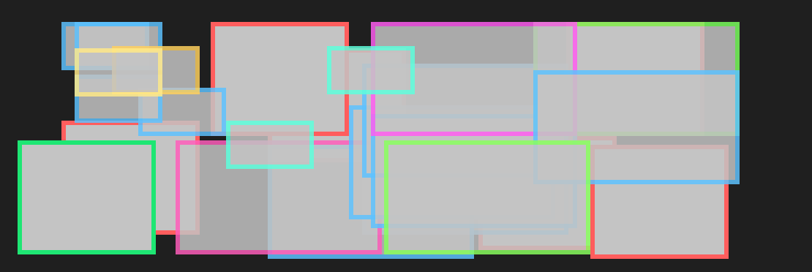

**Session 5 : Collisions - Types, Détection, Réponse et Préparation du Devoir 2**

**(Durée Totale Estimée : 6 heures, divisées en 4 blocs de 1h30)**

**Objectifs Clés de la Session :**

*   Comprendre les différents types de collisions (élastiques, inélastiques) et le rôle du coefficient de restitution.
*   Saisir les principes de base de la détection de collision pour des formes simples.
*   Analyser comment répondre à une collision en modifiant les vitesses des objets.
*   Se préparer pour le Devoir 2 qui impliquera l'implémentation de ces concepts.

---

**BLOC 1 : Comprendre les Collisions (1h30)**

*   **A. Introduction et Rappels Fondamentaux (20 minutes)**

    1.  **Rappel – Lois de Newton et Conservation de la Quantité de Mouvement (10 minutes)**
        *   *Points Clés :*
            La **2ème Loi de Newton** 

            ## $\vec{F}_{net} = m\vec{a}$ 
                
            ou
            ## $\vec{F}_{net} = \frac{d\vec{p}}{dt}$ 
            
        nous dit que les forces causent un changement de quantité de mouvement.
        
        La **3ème Loi de Newton** (Action-Réaction) est essentielle pour comprendre que les forces de collision entre deux objets sont internes à leur système.
        
        Le principe de **Conservation de la Quantité de Mouvement** ($`\vec{P}_{total}`$ du système est conservée si $`\vec{F}_{net, externe} = 0`$) est notre outil le plus important pour analyser ce qui se passe *pendant* une collision. Les forces externes (comme la gravité) sont souvent négligeables par rapport aux forces de contact intenses et brèves.

    2.  **Rappel – Énergie et Puissance (10 minutes)**
        *   *Points Clés :*
            *   L'**Énergie Cinétique** ($K = \frac{1}{2}mv^2$) est l'énergie due au mouvement. C'est cette forme d'énergie qui nous aidera à distinguer les types de collisions.
            *   Dans une collision, l'énergie cinétique est-elle toujours conservée ? C'est la question clé qui nous permettra de classer les collisions.

*   **B. Analyse de Votre Exemple Existant : La Balle qui Rebondit (15 minutes)**
    *   Nous allons observer votre simulation actuelle de la balle qui rebondit sur le sol.
    *   *Discussion :*
        *   Que se passe-t-il exactement lorsque la balle touche le sol ? (Sa vitesse change, surtout verticalement).
        *   Quelle est la cause de ce changement de vitesse ? (Une force de contact brève et intense exercée par le sol).
        *   La balle remonte-t-elle toujours à la même hauteur ? Cela nous donne un indice sur le type de collision.
        *   Comment pourrions-nous contrôler la "perte" d'énergie lors du rebond pour le rendre plus ou moins "énergique" ?
    *   Cette discussion nous amène naturellement aux différents types de collisions et à comment les quantifier.

*   **C. Types de Collisions (30 minutes)**
    *   La principale distinction entre les types de collisions se base sur ce qui arrive à l'**énergie cinétique totale** du système des objets qui entrent en collision.
    *   1.  **Collision Parfaitement Élastique :**
            *   **Définition :** L'énergie cinétique totale du système est **conservée** ($K_{total, initial} = K_{total, final}$).
            *   **Caractéristiques :** Aucune énergie n'est "perdue" sous forme de chaleur, de son, ou de déformation permanente des objets. Ils "rebondissent" parfaitement.
            *   *Exemples (idéalisés) :* Choc entre deux boules de billard, collisions entre atomes à basse énergie.
    *   2.  **Collision Inélastique :**
            *   **Définition :** L'énergie cinétique totale du système **diminue** ($K_{total, final} < K_{total, initial}$).
            *   **Caractéristiques :** Une partie de l'énergie cinétique initiale est transformée en d'autres formes d'énergie (chaleur due au frottement interne, son, énergie nécessaire pour déformer les objets de manière permanente).
            *   C'est le type de collision le plus courant dans le monde réel.
    *   3.  **Collision Parfaitement Inélastique (ou "Plastique") :**
            *   **Définition :** Un cas extrême de collision inélastique où les objets **collent ensemble** après l'impact.
            *   **Caractéristiques :** Ils se déplacent ensuite avec une **vitesse finale commune**. La perte d'énergie cinétique est maximale (tout en respectant la conservation de la quantité de mouvement).
            *   *Exemples :* Une boule de pâte à modeler qui frappe un mur et y reste collée, deux wagons de train qui s'accrochent.
    *   **Point Crucial à Retenir :** Dans *tous* ces types de collisions, si le système est isolé, la **quantité de mouvement totale du système est TOUJOURS conservée**.

        

*   **D. Coefficient de Restitution ($e$) (25 minutes)**
    *   **Définition :** Pour mesurer le degré "d'élasticité" d'une collision, nous utilisons le **coefficient de restitution**, noté $e$.
    *   Pour une collision frontale (en une dimension) entre deux objets A et B, ou pour un objet A rebondissant sur une surface B fixe (comme votre balle sur le sol) :
        $`e = \frac{|\text{Vitesse relative de séparation des objets APRES la collision}|}{|\text{Vitesse relative d'approche des objets AVANT la collision}|}`$
        Pour un objet rebondissant sur une surface fixe, si $v_{i, normal}$ est la composante de sa vitesse perpendiculaire à la surface juste avant l'impact, et $v_{f, normal}$ est cette composante juste après :
        $`e = \frac{|v_{f, normal}|}{|v_{i, normal}|}`$
    *   **Interprétation des valeurs de $e$ :**
        *   $`e = 1`$ : Collision **parfaitement élastique**.
        *   $`0 < e < 1`$ : Collision **inélastique**. (Plus $e$ est proche de 0, plus la collision est inélastique).
        *   $`e = 0`$ : Collision **parfaitement inélastique**. (Les objets ne se séparent pas, ou la balle ne rebondit pas du tout sur la surface).
    *   **Application à votre Exemple de Balle :**
        *   "Comment utiliser $e$ pour contrôler le rebond de notre balle ?"
        *   Si $v_{iy}$ est la vitesse verticale de la balle avant de toucher le sol, sa vitesse verticale juste après, $v_{fy}$, sera : $`v_{fy} = -e \cdot v_{iy}`$. Le signe "moins" indique que la direction de la vitesse s'inverse.
        *   *Démonstration :* Montrez (ou demandez aux étudiants d'essayer) de changer la valeur de $e$ dans le code de votre balle (par exemple, $e=0.9$ pour un bon rebond, $e=0.5$ pour un rebond mou, $e=0$ pour aucun rebond). Observez comment la hauteur du rebond change.
    *   Ce coefficient $e$ est un paramètre très utilisé dans les moteurs physiques pour définir le comportement des matériaux lors des chocs.


---

**BLOC 2 : Détection de Collision - Les Bases (1h30)**

*   **A. Qu'est-ce que la Détection de Collision ? Le Problème Fondamental (20 minutes)**

    1.  **Introduction : Pourquoi Détecter ?**
        *   Dans les sessions précédentes, nous avons vu comment les objets bougent et peuvent même rebondir. Mais avant qu'un rebond puisse se produire, notre simulation doit d'abord *savoir* que deux objets sont entrés en contact ou sont sur le point de le faire.
        *   C'est le rôle fondamental de la **détection de collision** : déterminer si, quand, et potentiellement comment, deux (ou plusieurs) objets dans notre monde virtuel occupent le même espace ou se chevauchent.
        *   Imaginez un jeu sans détection de collision : votre personnage passerait à travers les murs, les balles traverseraient les raquettes ! La détection de collision est donc essentielle pour créer des mondes interactifs et crédibles.

    2.  **Le Défi de la Détection :**
        *   Dans un jeu typique, il peut y avoir des centaines, voire des milliers d'objets en mouvement. Vérifier si chaque objet entre en collision avec chaque autre objet à chaque nouvelle image (frame) peut devenir une tâche très lourde pour l'ordinateur. Si nous avons $N$ objets, cela pourrait signifier environ $N^2/2$ paires à vérifier, ce qui augmente très vite !
        *   De plus, les objets peuvent avoir des formes très complexes (personnages 3D, terrains, bâtiments). Tester l'intersection de formes aussi complexes est difficile.
        *   C'est pourquoi des stratégies et des simplifications sont utilisées pour rendre la détection de collision efficace.

        
    3.  **L'Idée de Base : Le Test d'Intersection**
        *   Fondamentalement, détecter une collision revient à poser la question : "Est-ce que la forme géométrique de l'objet A et la forme géométrique de l'objet B se chevauchent (s'intersectent) dans l'espace à cet instant précis ?"
        *   **Exemple très simple : Deux points en 1D.** Si l'objet A est juste un point à la position $x_A$ et l'objet B est un point à $x_B$, ils sont en collision si $x_A = x_B$.
        *   **Exemple un peu plus complexe : Deux cercles en 2D.**
            *   Soit un cercle 1 de centre $C_1=(x_1, y_1)$ et de rayon $R_1$.
            *   Soit un cercle 2 de centre $C_2=(x_2, y_2)$ et de rayon $R_2$.
            *   Intuitivement, quand se touchent-ils ? Quand la distance $d$ entre leurs centres ($C_1$ et $C_2$) est inférieure ou égale à la somme de leurs rayons ($R_1 + R_2$).
            *   La distance $d$ se calcule avec le théorème de Pythagore : $d = \sqrt{(x_2-x_1)^2 + (y_2-y_1)^2}$.
            *   La condition de collision est donc : $d \le R_1 + R_2$.
            *   C'est un exemple de **test d'intersection** que nous allons examiner plus en détail. Notre objectif sera de nous concentrer sur de tels tests pour des formes géométriques simples.


*   **B. Techniques de Détection pour Formes Simples ("Narrow Phase" pour Primitives) (40 minutes)**

    *Ici, nous allons voir comment effectuer des tests d'intersection précis pour quelques formes géométriques de base. C'est ce qu'on appelle souvent la "phase étroite" de la détection de collision.*

    1.  **Test Cercle-Cercle (ou Sphère-Sphère en 3D) (10 minutes) :**
        *   C'est l'un des tests les plus simples et les plus rapides.
        *   **Données :**
            *   Cercle 1 : centre $\vec{c}_1 = (x_1, y_1)$, rayon $r_1$.
            *   Cercle 2 : centre $\vec{c}_2 = (x_2, y_2)$, rayon $r_2$.
        *   **Calculs :**
            *   Vecteur entre les centres : $\vec{d}_{centres} = \vec{c}_2 - \vec{c}_1 = (x_2-x_1, y_2-y_1)$.
            *   Distance (scalaire) entre les centres : $d = |\vec{d}_{centres}| = \sqrt{(x_2-x_1)^2 + (y_2-y_1)^2}$.
        *   **Condition de Collision :** Il y a collision si $`d \le r_1 + r_2`$.
        *   **Informations utiles si collision :**
            *   **Profondeur de Pénétration ($p$) :** Indique de combien les cercles se chevauchent. $`p = (r_1 + r_2) - d`$. Une valeur positive signifie pénétration.
            *   **Normale de Collision ($\hat{n}$) :** C'est un vecteur unitaire qui indique la direction "de l'impact". Elle est généralement définie comme le vecteur unitaire allant du centre d'un cercle vers le centre de l'autre (ou l'inverse, l'important est d'être cohérent). $`\hat{n} = \frac{\vec{d}_{centres}}{d}`$ (si $d \neq 0$). Cette normale est cruciale pour calculer la réponse à la collision (le rebond).
        *   *Utilisations : Parfait pour les balles, projectiles ronds, ou comme première approximation pour des objets plus complexes (on parle alors de "sphères englobantes").*

    2.  **Test Rectangle-Rectangle Alignés sur les Axes (AABB vs AABB) (15 minutes) :**
        *   Un **AABB** (Axis-Aligned Bounding Box) est un rectangle dont les côtés sont toujours parallèles aux axes X et Y du système de coordonnées du monde. Il ne tourne pas avec l'objet qu'il pourrait représenter.
        *   Un AABB est défini par ses coordonnées minimales et maximales :
            *   AABB A : $(A_{xmin}, A_{ymin})$ et $(A_{xmax}, A_{ymax})$
            *   AABB B : $(B_{xmin}, B_{ymin})$ et $(B_{xmax}, B_{ymax})$
        *   **Condition de Collision :** Deux AABB se touchent s'il y a un chevauchement de leurs intervalles sur l'axe X **ET** un chevauchement de leurs intervalles sur l'axe Y.
            *   Il est souvent plus facile de vérifier la condition de **NON-collision** : les AABB *ne se touchent pas* si :
                *   A est complètement à gauche de B : $A_{xmax} < B_{xmin}$ **OU**
                *   A est complètement à droite de B : $A_{xmin} > B_{xmax}$ **OU**
                *   A est complètement en dessous de B : $A_{ymax} < B_{ymin}$ **OU**
                *   A est complètement au-dessus de B : $A_{ymin} > B_{ymax}$
            *   Si *aucune* de ces quatre conditions de non-collision n'est vraie, alors il y a collision.
        *   **Informations utiles si collision :**
            *   On peut calculer le **Vecteur de Translation Minimum (MTV)**. C'est le plus petit déplacement à appliquer à l'une des boîtes pour résoudre l'interpénétration. La **normale de collision** sera alignée avec l'axe du MTV (l'axe où le chevauchement est le plus faible pour la séparation).
        *   *Utilisations : Idéal pour les niveaux basés sur des tuiles, les plateformes, les murs fixes, ou comme boîtes englobantes grossières.*

            

    3.  **Autres Primitives Simples (Brève Présentation) (5 minutes) :**
        *   **Point dans Cercle :** 
            
            Un point $P$ est dans un cercle de centre $C$ et rayon $R$ si $\text{distance}(P,C) \le R$.
        *   **Point dans Rectangle (AABB) :** 
        
        Un point $P(x_p, y_p)$ est dans une AABB si $x_{min} \le x_p \le x_{max}$ ET $y_{min} \le y_p \le y_{max}$.

    4.  **Le Défi des Formes Orientées et Complexes (Ouverture) (10 minutes) :**
        *   Les tests précédents fonctionnent bien pour des formes simples ou alignées sur les axes. Mais que faire si nous avons des rectangles qui peuvent tourner (on parle alors de Boîtes Englobantes Orientées - OBB) ou des formes polygonales plus complexes (comme un personnage de jeu) ?
        *   Les tests d'intersection deviennent plus complexes. Une méthode générale et très importante pour les formes **convexes** (formes sans "creux") est le **Théorème des Axes Séparateurs (SAT)**.
        *   **Concept du SAT (sans entrer dans l'implémentation) :** Si deux formes convexes ne s'intersectent pas, on peut toujours trouver une ligne (un "axe séparateur") telle que si l'on projette les deux formes sur cette ligne (comme faire leur "ombre"), ces ombres ne se chevauchent pas. Le SAT consiste à tester un ensemble spécifique d'axes (généralement les lignes perpendiculaires aux faces de chaque forme). Si l'on trouve *un seul* axe où les projections ne se chevauchent pas, il n'y a pas de collision. Si les projections se chevauchent sur *tous* les axes testés, alors il y a collision.
        *   Le SAT est une technique puissante que les moteurs physiques utilisent souvent.
        

*   **C. Optimisation de la Détection : Phases "Broad" et "Narrow" (15 minutes)**
    *   Dans un jeu avec de nombreux objets, même des tests simples comme AABB vs AABB peuvent devenir trop lents si on doit tester chaque paire d'objets ($N^2$ tests).
    *   Pour optimiser, on utilise souvent une approche en deux étapes :
    *   **1. Phase Large ("Broad Phase") – Le Grand Tri :**
        *   **Objectif :** Éliminer rapidement la grande majorité des paires d'objets qui sont clairement trop éloignés pour entrer en collision.
        *   **Méthodes :** On utilise des formes englobantes très simples (AABB ou sphères) autour de chaque objet. Des structures de données spatiales (comme des grilles qui divisent le monde, ou des arbres comme les Quadtrees/Octrees) sont utilisées pour rapidement identifier quels objets sont dans la même "région" et pourraient donc potentiellement se toucher.
        *   Cette phase ne dit pas "oui, il y a collision", mais plutôt "ces deux objets sont assez proches, ils *pourraient* être en collision, il faut vérifier plus en détail". Elle produit une liste de paires "candidates".
    *   **2. Phase Étroite ("Narrow Phase") – L'Examen Détaillé :**
        *   **Objectif :** Pour chaque paire d'objets candidate fournie par la phase large, on effectue maintenant un test de collision précis en utilisant leurs formes géométriques réelles (ou des approximations convexes plus fines).
        *   C'est ici que l'on utilise les tests que nous avons vus (Cercle-Cercle, AABB-AABB, SAT pour les polygones, etc.).
        *   Si une collision est confirmée, cette phase calcule également des informations importantes pour la réponse à la collision, comme le point de contact, la normale de collision, et la profondeur de pénétration.
    *   Cette stratégie en deux phases améliore considérablement les performances de la détection de collision dans les scènes complexes.


---

**BLOC 3 : Réponse aux Collisions Simples et Démonstration Interactive (1h30)**

*   **A. Principes Fondamentaux de la Réponse aux Collisions (20 minutes)**
    *   "Maintenant que nous savons comment détecter une collision, que devons-nous faire pour que les objets réagissent de manière crédible ?"
    *   La **réponse à la collision** est le processus qui modifie l'état des objets (principalement leur position et leur vitesse) après qu'une collision a été détectée.
    *   Elle comporte généralement deux aspects principaux :
        1.  **Résolution de l'Interpénétration :** Empêcher les objets de "s'enfoncer" les uns dans les autres.
        2.  **Changement des Vitesses :** Simuler l'effet de l'impact sur le mouvement des objets (le rebond).
*   **B. Résolution de l'Interpénétration (20 minutes)**
    *   **Le Problème :** Dans une simulation avec des pas de temps discrets ($\Delta t$), au moment où nous détectons une collision, les objets peuvent déjà avoir légèrement dépassé leur point de contact idéal et s'être interpénétrés. Si nous ne corrigeons pas cela, ils peuvent sembler "collés" ou passer à travers.
    *   **La Solution (Concept) :** Il faut "séparer" les objets.
        *   On calcule le **Vecteur de Translation Minimum (MTV)** : C'est le plus petit vecteur par lequel il faut déplacer l'un des objets (ou les deux proportionnellement) pour qu'ils se touchent juste, sans se chevaucher.
        *   La direction du MTV est généralement opposée à la normale de collision, et sa magnitude est la profondeur de pénétration.
        *   **Action :** On ajuste la position d'au moins un des objets en utilisant le MTV.
            *   *Exemple simple : Si une balle de rayon $R$ à la position $x_{balle}$ frappe un mur vertical à $x_{mur}$ et que $x_{balle}-R < x_{mur}$ (pénétration), on repositionne la balle à $x_{balle} = x_{mur} + R$.*
    *   "Les moteurs physiques ont des algorithmes sophistiqués pour calculer le MTV et résoudre les interpénétrations de manière stable, surtout pour des contacts multiples."
*   **C. Modification des Vitesses : Le Rebond (Cas Balle contre Mur Immobile) (30 minutes)**
    *   C'est ici que nous appliquons les principes vus au Bloc 1 (coefficient de restitution) et les lois de Newton.
    *   **Étapes pour un Rebond Simple sur une Surface Plane (Mur ou Sol) :**
        1.  **Après la Détection et la Résolution de Pénétration :** Nous avons la vitesse de la balle $\vec{v}_i$ juste avant l'impact (ou du moins, à la fin du pas de temps où la collision a été détectée).
        2.  **Identifier la Normale à la Surface de Collision ($\hat{n}$) :**
            *   C'est un vecteur unitaire perpendiculaire à la surface, pointant vers l'extérieur de la surface.
            *   Pour un sol horizontal en $y=y_{sol}$, $\hat{n} = \begin{pmatrix} 0 \\ 1 \end{pmatrix}$ (si la balle vient d'en haut).
            *   Pour un mur vertical à $x=x_{mur}$, si la balle vient de la gauche, $\hat{n} = \begin{pmatrix} 1 \\ 0 \end{pmatrix}$. Si elle vient de la droite, $\hat{n} = \begin{pmatrix} -1 \\ 0 \end{pmatrix}$.
        3.  **Décomposer la Vitesse Incidente $\vec{v}_i$ (Optionnel mais conceptuellement utile) :**
            *   On peut projeter $\vec{v}_i$ sur la normale $\hat{n}$ pour obtenir la **composante normale de la vitesse** ($v_{i,n} = \vec{v}_i \cdot \hat{n}$).
            *   Et sur la tangente à la surface pour obtenir la **composante tangentielle de la vitesse** ($v_{i,t}$).
        4.  **Appliquer la Réponse basée sur le Coefficient de Restitution ($e$) :**
            *   **Composante Normale de la Vitesse Finale :** La vitesse normale s'inverse et est réduite par $e$.
                $`v_{f,n} = -e \cdot v_{i,n}`$
            *   **Composante Tangentielle de la Vitesse Finale :** Si l'on néglige le frottement pendant l'impact avec le mur, la vitesse tangentielle reste généralement inchangée.
                $`v_{f,t} = v_{i,t}`$
                (Le frottement, que nous verrons au Bloc 4, affecterait cette composante).
        5.  **Nouvelle Vitesse Vectorielle ($\vec{v}_f$) :** La nouvelle vitesse de la balle est la recombinaison de $v_{f,n}$ (dans la direction $\hat{n}$) et $v_{f,t}$ (dans la direction tangentielle).
            *   *Pour un cas simple comme un rebond sur un sol horizontal (normale $\hat{n}=(0,1)$) :*
                *   $v_{ix} \rightarrow v_{fx} = v_{ix}$ (la composante tangentielle X reste la même)
                *   $v_{iy} \rightarrow v_{fy} = -e \cdot v_{iy}$ (la composante normale Y s'inverse et est réduite)
*   **D. Démonstration Interactive : Amélioration de Votre Exemple de Balle (20 minutes)**
    *   Nous allons reprendre votre simulation de balle qui rebondit et y ajouter des murs pour former une boîte fermée.
    *   **Ensemble, nous allons (ou vous observerez) :**
        1.  **Définir les limites de la boîte** (par des variables : $x_{min}, x_{max}, y_{min}, y_{max}$). Vous pouvez ajouter des lignes visuelles dans Three.js pour ces limites.
        2.  **Implémenter la Détection Balle-Mur :** Dans la boucle de simulation, après avoir mis à jour la position de la balle, ajouter des conditions `if` pour vérifier si la balle a dépassé chaque limite.
        3.  **Implémenter la Réponse au Rebond pour chaque mur :**
            *   Repositionner la balle pour résoudre la pénétration.
            *   Inverser la composante appropriée de la vitesse et la multiplier par un `coefficientRestitution` (que vous pourrez contrôler via `dat.GUI` ou une variable).
        4.  **Tester avec Différentes Valeurs de `coefficientRestitution` :** Observer comment la balle se comporte (rebonds hauts et vifs pour $e \approx 1$, rebonds mous pour $e$ petit, aucun rebond pour $e=0$).
    *   "Cette démonstration vous donnera une base solide pour ce que vous aurez à faire dans le Devoir 2."

---

**BLOC 4 : Introduction au Frottement et Présentation du Devoir 2 (1h30)**

*   **A. Introduction aux Forces de Frottement (35 minutes)**
    *   "Nous avons vu comment les balles rebondissent. Mais dans la réalité, une balle qui roule ou glisse sur le sol finit par s'arrêter, même sans heurter de mur. Qu'est-ce qui la ralentit ?"
    *   **Le Frottement :** Une force qui s'oppose au mouvement relatif (ou à la tendance au mouvement) entre deux surfaces en contact.
    *   **1. Frottement Statique ($f_s$) (Concept) :**
        *   La force qui empêche un objet de *commencer* à bouger lorsqu'une force est appliquée.
        *   Elle s'ajuste jusqu'à une valeur maximale : $f_{s,max} = \mu_s N$.
            *   $\mu_s$ : Coefficient de frottement statique (dépend des matériaux en contact).
            *   $N$ : Magnitude de la force normale (la force de support perpendiculaire exercée par la surface).
        *   Si la force appliquée dépasse $f_{s,max}$, l'objet se met à bouger, et le frottement devient cinétique.
    *   **2. Frottement Cinétique (ou Dynamique, $f_k$) (Celui qui nous intéresse pour le Devoir 2) :**
        *   La force qui s'oppose au mouvement d'un objet qui *glisse déjà* sur une surface.
        *   Sa magnitude est généralement considérée comme constante (ou approximativement constante) et est donnée par :
            $`f_k = \mu_k N`$
            *   $\mu_k$ : Coefficient de frottement cinétique. Souvent $\mu_k < \mu_s$.
            *   $N$ : Magnitude de la force normale.
        *   **Direction de la Force de Frottement Cinétique :** Toujours **opposée** à la direction du vecteur vitesse de l'objet par rapport à la surface.
    *   **3. Force Normale ($N$) sur un Plan Horizontal :**
        *   Si un objet de masse $m$ repose (ou glisse) sur un sol horizontal, et que la seule autre force verticale est la gravité ($\vec{F}_g = m\vec{g}$), alors pour que l'objet ne s'enfonce pas dans le sol ni ne s'envole, la force normale exercée par le sol sur l'objet doit équilibrer la gravité : $N = |\vec{F}_g| = mg$.
        *   (Si d'autres forces verticales sont présentes, $N$ peut être différent).
    *   **4. Application à la Balle au Sol pour le Devoir 2 :**
        *   Lorsque votre balle est en contact avec le sol (sa position $y \approx R_{balle}$) et qu'elle a une vitesse horizontale ($v_x \neq 0$ et/ou $v_z \neq 0$ si en 3D) :
            *   Une force de frottement cinétique s'opposera à son mouvement horizontal.
            *   Exemple en 2D pour la composante X : $`F_{frottement,x} = -\mu_k N \cdot \text{signe}(v_x)`$.
                *   Le terme $\text{signe}(v_x)$ vaut +1 si $v_x > 0$, -1 si $v_x < 0$, et 0 si $v_x=0$. Cela assure que la force s'oppose bien au mouvement.
            *   Cette force de frottement causera une décélération : $`a_{frottement,x} = F_{frottement,x} / m = -\mu_k (mg) / m \cdot \text{signe}(v_x) = -\mu_k g \cdot \text{signe}(v_x)`$.
            *   "Vous verrez que cette décélération constante ralentira progressivement la balle jusqu'à l'arrêt."
*   **B. Démonstration (Optionnelle) : Ajout d'un Frottement Simple (20 minutes)**
    *   Si le temps le permet, retournez à votre démo de "balle dans une boîte".
    *   **Ajoutez la logique de frottement :**
        *   Dans la boucle de simulation, vérifiez si la balle est au sol ( `Math.abs(balle.position.y - balle.rayon) < epsilon` ) ET si `Math.abs(balle.vitesse.x) > epsilon_vitesse`.
        *   Si oui, appliquez une force de frottement à `balle.vitesse.x` (en fait, une décélération) :
            ```javascript
            // const mu_k = 0.1; // Coefficient de frottement
            // if (balle_est_au_sol && Math.abs(balle.vitesse.x) > 0.01) {
            //     let frictionForceMagnitude = mu_k * balle.masse * Math.abs(graviteY);
            //     let accelerationFrictionX = -Math.sign(balle.vitesse.x) * frictionForceMagnitude / balle.masse;
            //     balle.vitesse.x += accelerationFrictionX * dt;
            //     // Empêcher la balle de changer de sens à cause du frottement
            //     if ( (vitesse_x_avant_friction > 0 && balle.vitesse.x < 0) || (vitesse_x_avant_friction < 0 && balle.vitesse.x > 0) ) {
            //         balle.vitesse.x = 0;
            //     }
            // }
            ```
    *   Observez comment la balle qui roule/glisse sur le sol finit par s'arrêter.
